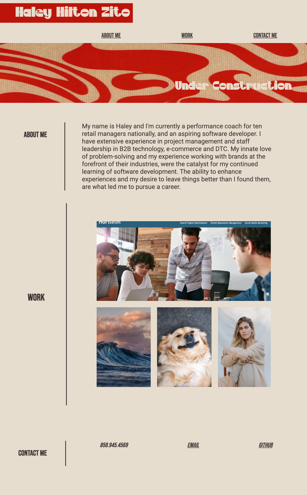
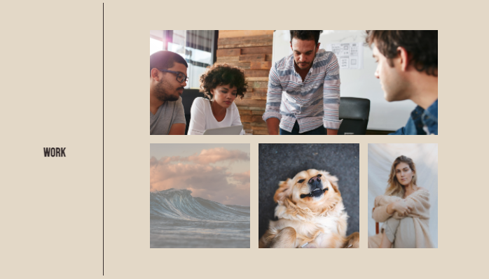
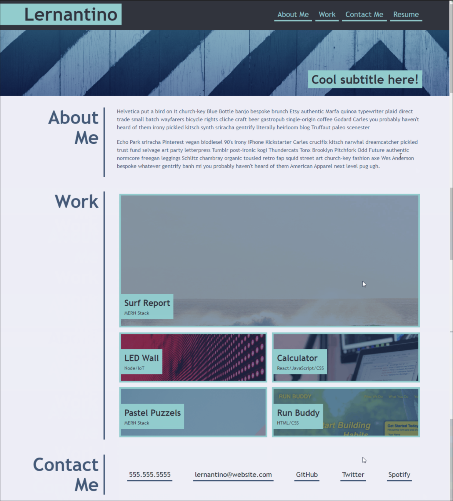

# Haley-Zito-Portfolio
Portfolio Project - Homework #2 for UCSD bootcamp
Bootcamp Live Site: https://haleyhilton.github.io/Haley-Zito-Portfolio/

This project acts as an *updated* interim version of my portfolio which I will
A. continue to add to with more work
B. clean-up to be more representative of my skill-set as I learn and truer to my eye for design (planning to use React to do so in the future)

Namely, this application hosts a grid section to make a responsive area to host my work that links out to other deployed applications. The portfolio also uses strong media queries to insure functionality across multiple devices, although, my main focus was how it would show up on large desktops and phones. 

This is how the portfolio should perform at it's max potential. I used a 50% border radius to achieve the contact image that disappears at smaller screens. When you click on the links in navigation it will take you to the corresponding section.

I used grid to get a flexible and responsive work section that molds to it's container size as the screen size changes. While I'm extremely happy with the responsiveness of the grid - it did pose some challenges when creating a href tag to link out to deployed projects. 

The Work section should function as follows when hovering over work that is in there as place holders vs. linking out to deployed projects. Any work that is a place holder will show an opacity of .5 when hovering over to indicate this section is coming soon and should not be clicked on.

Overall, I'm very happy with the way this came out but trying to stay true to the functionality and basic outline of the example image wound up compromising a little of what I know my artistic output could've been. Excited to come back to and build upon this project in the future. 

The below is not representative of the deployed project, rather, it's the example / guidance format given for the project outline.
